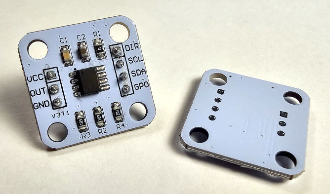

# Toit driver for AMS AS5600 I2C magnetic rotation Hall-Effect Sensor

The AS5600 is a programmable Hall-based rotary magnetic position sensor with a
high-resolution 12-bit analog, or PWM output, for contactless potentiometers.
Based on planar Hall technology, this device measures the orthogonal component
of the flux density (Bz) from an external magnet while rejecting stray magnetic
fields. [Datasheet](https://files.seeedstudio.com/wiki/Grove-12-bit-Magnetic-Rotary-Position-Sensor-AS5600/res/Magnetic%20Rotary%20Position%20Sensor%20AS5600%20Datasheet.pdf)



I originally started experimenting with this device whilst trying to find a way
to implement a knob for a project where I did not want to drill through it's
beautiful casing.

## Features:

### I2C mode:
Using the I2C Interface, all functions of the AS5600 can be configured and
(permanently**) programmed. Additionally the output angle and a raw angle (unmodified
value) can be read from the output registers.

### 3-wire mode
The Datasheet describes a way of configuring/programming the device without I2C.
This is not covered here - please see the datasheet for this information.

### Functions
The driver implements two major read functions:
- `read-angle`: reads an angle (0-4095).  The `--steps` switch optionally scales
  this to a target range - results in a value (0 <= x <= steps) where one full
  revolution divided up into 'steps' sectors.
```Toit
// I2C setup omitted
// Outputs an angle in the 12-bit (0-4095) space:
print as5600-driver.read-angle  // e.g. 2895

// Outputs an angle in the 0-360 degree space:
print as5600-driver.read-angle --steps=360.0  // e.g. 254.62

// Outputs an angle in Radians. Use this import:
import math
// The supply the following steps
print as5600-driver.read-angle --steps=(2 * math.PI)  // 4.44087
```
- `read-raw-angle`: reads the angle without having been passed through any
  configuration pipeline.  (There is no ranging functionality.) This means that
  the following features will not apply:
  - Start, end and max angle registers - adjusting usable range.
  - Output stage including hysteresis and filtering.

### Reduced Resolution
The default output range is from 0 to 4095 counts over a full turn. The full
12-bit resolution can be applied to a smaller mechanical range either by
programming a zero and stop, or, by setting a maximum span.
The example below sets a window using start/stop:
```Toit
// I2C setup omitted
// Set start and stop as a new range
as5600-driver.set-start-position 1024
as5600-driver.set-stop-position 2048

// Set new Maximum Angle (as a positive integer of 1/4095's of a rotation)
as5600-driver.set-start-position 1024
as5600-driver.set-stop-position 2048
```

### DIR Pin
Direction (clockwise vs. counterclockwise): If DIR is connected to GND (DIR =
0) a clockwise rotation viewed from the top will generate an increment of the
calculated angle. If the DIR pin is connected to VDD (DIR = 1) an increment of
the calculated angle will happen with counterclockwise rotation.  This can be
set dynamically using a GPIO pin at runtime by connecting one to the ESP32.
```Toit

```

### Output and the OUT Pin
The OUT pin can be analog (ratiometric) or PWM, selectable using
`set-output-stage-analog`/`set-output-stage-reduced-analog` or
`set-output-stage-digital`.  If selecting digital, PWM frequency can be selected
between a limited number of choices (see related constants) using
`set-pwm-frequency`:
```Toit
// Sets the output to PWM
as5600-driver.set-output-stage-digital

// Sets the PWM frequency to 460Hz
as5600-driver.set-pwm-frequency As5600.PWM-FREQ-460HZ
```

### Magnet Presence
The device can advise on both the presence of a magnet and if it is too
strong/weak using the following functions:
```Toit
print "Is magnet there?      $as5600-driver.is-magnet-there"
print "Is magnet too weak?   $as5600-driver.is-magnet-too-weak"
print "Is magnet too strong? $as5600-driver.is-magnet-too-strong"
```

### Permanent programming
The device has a limited number of permanently written save slots (referred to
in the datasheet as OTP).  These are 3, in the case of Start Position and Stop
Position, but only one in the case of the wider settings.  The functions in the
library have an 'are you sure' switch, but have not been tested for lack of
sacrificial test units.  The function `get-previous-burns` can advise if there
have been previous OTP writes.

### Other Features
The device supports configuring other features, which are implemented in the
driver.  Please consult the datasheet, examples and source code:
- Hysteresis
- Automatic Gain Control
- Fast/Slow Filtering
- Watchdog (reduces power when not being used)
- Power modes
- Magnitude

### A note about testing
My modules shipped with a small round magnet.  My results were a bit
inconsistent until I realized the magnet’s polarization/orientation wasn't
unsuitable. Test with a known magnet (correct orientation) for reliable results.

## Links
- [Device
  Datasheet](https://files.seeedstudio.com/wiki/Grove-12-bit-Magnetic-Rotary-Position-Sensor-AS5600/res/Magnetic%20Rotary%20Position%20Sensor%20AS5600%20Datasheet.pdf)

## Issues
If there are any issues, changes, or any other kind of feedback, please
[raise an issue](https://github.com/milkmansson/toit-as5600/issues). Feedback is
welcome and appreciated!

## Disclaimer
- This driver has been written and tested with an unbranded module as pictured.
- Writing to OTP memory has not been tested, I didn't have test units to
  sacrifice.
- All trademarks belong to their respective owners.
- No warranties for this work, express or implied.

## Credits
- AI has been used for reviews, analysing & compiling data/results, and
  assisting with ensuring accuracy.
- [Florian](https://github.com/floitsch) for the tireless help and encouragement
- The wider Toit developer team (past and present) for a truly excellent product

## About Toit
One would assume you are here because you know what Toit is.  If you dont:
> Toit is a high-level, memory-safe language, with container/VM technology built
> specifically for microcontrollers (not a desktop language port). It gives fast
> iteration (live reloads over Wi-Fi in seconds), robust serviceability, and
> performance that’s far closer to C than typical scripting options on the
> ESP32. [[link](https://toitlang.org/)]
- [Review on Soracom](https://soracom.io/blog/internet-of-microcontrollers-made-easy-with-toit-x-soracom/)
- [Review on eeJournal](https://www.eejournal.com/article/its-time-to-get-toit)
